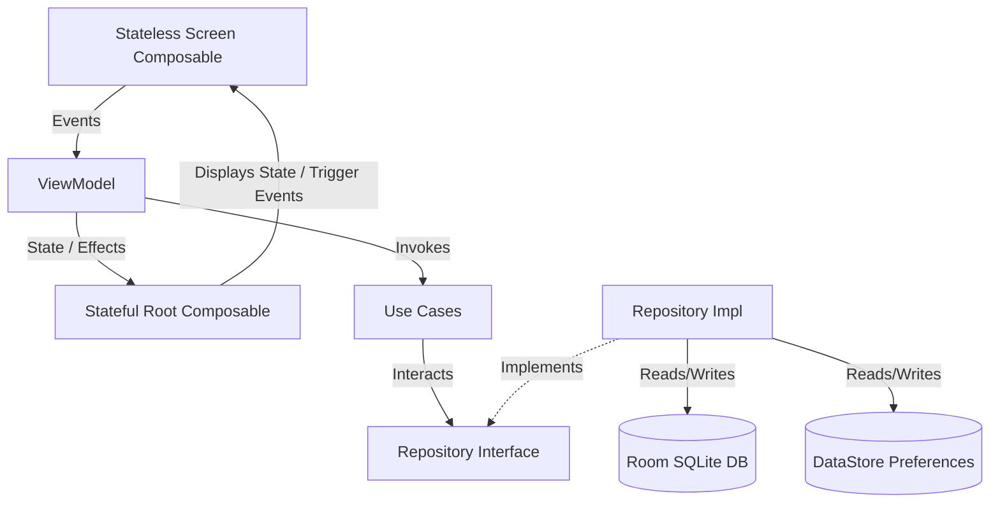

# LiftHive — Premium Workout Tracker & Analytics Journal

> **"Journal today, progress tomorrow. Unleash your potential."**

**LiftHive** is a premium, state-of-the-art Android workout tracker built using modern Android development practices. It is designed to offer a seamless logging experience coupled with rich, visual, and highly comprehensive analytics to help athletes track their training volume, personal records (PRs), consistency, and intensity progression.

---

## 📱 Features

### 1. Home Feed & Dashboard Summary Hero
- **Frost-Gradient Hero Banner**: Dynamically greets the user based on the time of day and displays the motivational app philosophy.
- **Streak Tracker**: Tracks and highlights the current consecutive training streak (🔥).
- **Core Stat Grid**: 4-stat metric dashboard summarizing Total Sessions, Total Volume (kg), Best Streak (days), and Average Volume per Session (kg).
- **Collapsing Scroll Header**: A scroll-aware collapsing header that smoothly collapses the Hero Dashboard card, Search Bar, and title header out of view as the user scrolls past the top 3 cards, maximizing focus on the workout feed.
- **Swipe-to-Delete**: Interactively swipe workout cards to delete with custom scale-and-fade garbage bin icon animations based on gesture progress (requires a deliberate 65% pull threshold).

### 2. Rich Analytics Dashboard (Stats)
- **Podium Ranking**: Highlights the top 5 most frequently logged exercises with custom Gold, Silver, and Bronze theme labels.
- **Consistency Map**: A GitHub-style activity contribution map grid showing training history and frequency over the last 12 weeks.
- **Training Intensity (Canvas Horizontal Chart)**: Auto-scrolls and sticks to the latest session. Renders raw volumes via custom vertical bar graphs and overlays guide lines drawn on a Canvas.
- **Weekly Volume Trend (Vertical Scroll)**: A vertical, fixed-height progress view displaying weekly volume trend metadata along with clean date ranges (e.g. "Jul 28 – Aug 3").

### 3. Log / Edit Session Workflow
- Form validation preventing blank sessions.
- Dynamic exercise list supporting real-time additions and removals.
- Relational delta-updates in the SQLite engine using Room's modern `@Upsert` APIs.

---

## 🏗️ Architecture & Clean Code Patterns

LiftHive is built in strict compliance with **Clean Architecture** and **Unidirectional Data Flow (UDF)** patterns:



### 1. Presentation Layer (`presentation/`)
- **Stateful Root Composables (`*Root`)**: Entry points mapped to NavGraph. They handle dependency injections via Hilt, collect UI state flows, and listen to one-shot actions (Toasts, dialogs, backstack navigations) by collecting from ViewModel Channel-based `Flow` side-effect streams.
- **Stateless Screen Composables (`*Screen`)**: Pure, decoupled UI components that render the given state and emit user interactions via unified event callback lambdas (`onEvent`).
- **Event-Driven ViewModels (`onEvent`)**: Individual public actions inside ViewModels have been refactored into a single event receiver. Screen inputs are mapped to a sealed interface of events (e.g., `HomeEvent`, `AddEditWorkoutEvent`).

### 2. Domain Layer (`domain/`)
- **Use Cases**: Encapsulate independent pieces of business logic (e.g., `GetStatsUseCase` which divides complex metrics like streak, weekly volume, and podium calculations into cohesive private sub-tasks).
- **Model Layer**: Lightweight, raw data representations (e.g., `Workout`, `Exercise`, `WorkoutStats`) decoupled from database tables.
- **Repository Interface**: Declares structural boundary declarations for data fetching.

### 3. Data Layer (`data/`)
- **Room Database**: Uses a reactive SQLite data access object (`WorkoutDao`) using Room's modern **`@Upsert`** operations for robust relational inserts and updates.
- **Preferences DataStore**: Manages application storage (e.g., dark theme toggle) asynchronously utilizing Jetpack DataStore Preferences to avoid main-thread blocking.
- **Repository Implementation**: Implements boundary interfaces, manages dummy seed data, and runs delta-upserts (deleting only removed child items, inserting new ones, and updating existing ones in-place to preserve primary key values).

---

## 📂 Package Directory Structure

```
com.example.lifthive
├── data
│   ├── local
│   │   ├── preferences     # DataStore Preferences Manager
│   │   └── room            # Room Database, Entities, and Dao
│   └── repository          # Workout & Preferences Repo Implementations
├── domain
│   ├── model               # Immutable Domain models
│   ├── repository          # Repository boundaries
│   └── usecase             # Single-responsibility business use cases
├── di                      # DataModule, RepositoryModule, and UseCaseModule
├── presentation            # UI layer
│   ├── add_edit            # Log / Edit Session screen & components
│   ├── details             # Workout Details screen & components
│   ├── home                # Workout Feed & Dashboard Summary
│   ├── settings            # Dark theme, Reset data, Clear db
│   ├── splash              # Splash loading logo screen
│   ├── stats               # Analytics Dashboard
│   └── navigation          # Navigation host graph and Serializable screens
└── ui
    └── theme               # Typography, Shapes, Colors, and LiftHiveTheme
```

---

## 🛠️ Build & Setup Instructions

### Prerequisites
- Android Studio Ladybug (or higher)
- Gradle JDK 17
- Android SDK 34+

### Steps
1. Clone the repository:
   ```bash
   git clone https://github.com/VivekShah138/LiftHive_Assessment.git
   ```
2. Open the project in Android Studio.
3. Sync Gradle and build the project.
4. Run the application on an emulator or a physical device.
5. Head to **Settings** (Gear icon on Top Right) -> click **Load Demo Data** to populate the application with a pre-seeded, rich 4-week training history to explore the charts and analytics dashboard.

---

## ⚡ Behind the Iron: A 24-Hour Coding Session

This entire app was hammered out, modularized, and polished in a non-stop **24-hour sprint** to beat the assessment clock! ⏳

Behind this premium dark fitness aesthetic lies:
- **3 cups of cold brew coffee** ☕
- **A lot of compiler-induced adrenaline** ⚡
- **A complete disregard for standard sleep cycles** 💀

If you run into any minor spacing alignments or logic quirks, remember they were written at 3:00 AM when the screen was glowing brighter than my future. 

### 🙌 Show Some Support!
If you appreciate the 24-hour survival story, the custom Canvas charts, or the Clean Architecture UDF flow, please drop a ⭐ on this repository! It keeps the caffeine flowing and the code compiling.

Thanks for stepping into the LiftHive. Let's build those gains! 🏋️‍♂️🔥


